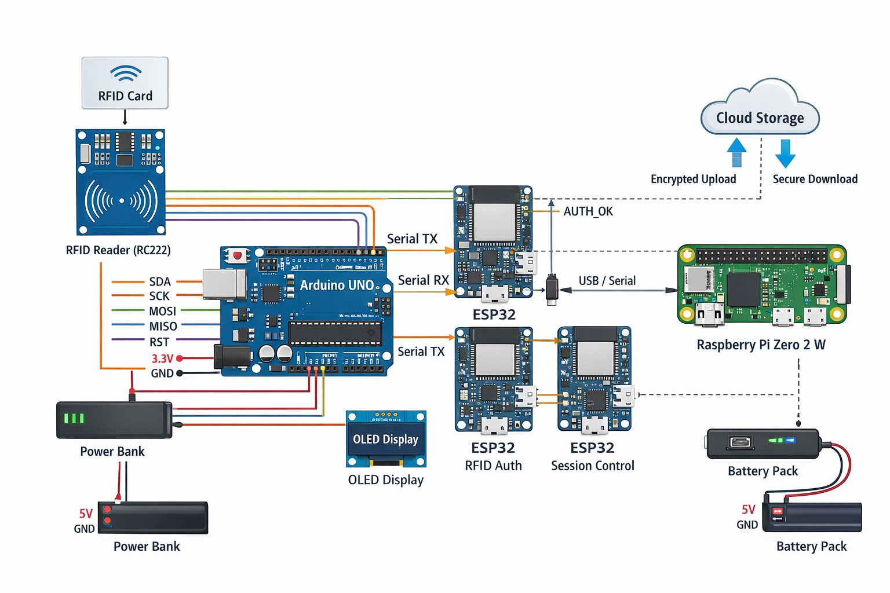

 # Hardware-Authenticated Secure Cloud Storage (IoT + Embedded Linux)

 ## Contents

 - [Project Description](#1-project-description)
 - [System Objectives](#2-system-objectives)
 - [Technology Stack](#technology-stack)
 - [Hardware and Module Overview](#3-hardware-and-module-overview)
 - [Overall System Architecture](#4-overall-system-architecture)
 - [User Workflow (User Point of View)](#5-user-workflow-user-point-of-view)
 - [Backend Workflow (System Internal Operation)](#6-backend-workflow-system-internal-operation)
 - [Flowchart Description (Textual)](#7-flowchart-description-textual)
 - [Security Features](#8-security-features)
 - [Advantages of the System](#9-advantages-of-the-system)
 - [Conclusion](#10-conclusion)

 ## 1. Project Description

 This project implements a **standalone, hardware-authenticated secure cloud storage system** using low-cost IoT and embedded platforms. Files are **encrypted locally before any cloud upload**, and **encryption/decryption operations are gated by physical authentication**.

 Unlike traditional cloud storage solutions that rely only on software-based passwords, this system integrates **RFID-based hardware authentication**, **session control using ESP32 modules**, and **local cryptographic processing on an embedded Linux device**. The complete system operates **without a laptop**, runs automatically on power-up, and is accessible only through a **LAN-based web application**.

 The design demonstrates strong principles of **cybersecurity, defense-in-depth, and secure system architecture**, making it suitable for academic evaluation and real-world secure storage use cases.

 ---

 ## 2. System Objectives

 - Ensure **hardware-backed authentication** for secure data access
 - Perform **encryption and decryption locally** before cloud interaction
 - Guarantee the cloud stores **ciphertext only** (no plaintext exposure)
 - Operate as a **standalone embedded system** (no external computer dependency)
 - Provide **secure file destruction** beyond standard software deletion
 - Demonstrate a **defense-in-depth** embedded security architecture

 ---

 ## Technology Stack

 - **Microcontrollers:** ESP32 (×3), Arduino Uno (R3)
 - **Embedded Platform:** Raspberry Pi Zero 2 W (Linux)
 - **Authentication:** RFID (RC522)
 - **Display:** OLED (I2C)
 - **Communication Protocols:** SPI, I2C, UART, USB Serial
 - **Networking:** LAN (Wi-Fi)
 - **Security:** Local encryption, hardware authentication
 - **Cloud Access:** API-based encrypted upload/download

## 3. Hardware and Module Overview

### 3.1 ESP32 Modules (Three Units)

**ESP32-A – Hardware Authentication Controller**
- Receives RFID UID from Arduino Uno
- Verifies authorized users
- Generates authentication status/token
- Acts as the primary hardware security gate

**ESP32-B – Session Control & Command Validation**
- Validates each requested operation
- Enforces session timeout and re-authentication
- Prevents replay or unauthorized reuse of sessions

**ESP32-C – System Health & Tamper Monitor**
- Monitors power and reset conditions
- Sends heartbeat signals
- Revokes access on abnormal behavior

---

### 3.2 Raspberry Pi Zero 2 W – Main Processing Unit

The Raspberry Pi Zero 2 W acts as the **central brain** of the system.

Functions:
- Automatically boots into headless mode
- Auto-starts LAN-based web application
- Performs file encryption and decryption
- Manages cloud upload and download using API keys
- Stores API keys securely
- Performs secure file destruction using multi-pass overwrite
- Communicates with all ESP32 modules

---

### 3.3 Arduino Uno – Peripheral Controller

- Interfaces with RFID reader
- Reads RFID card UID
- Controls OLED display
- Sends UID data to ESP32-A
- Remains isolated from network and cloud access

---

### 3.4 RFID Module

- Provides physical authentication
- Enables tap-based user verification
- Prevents remote-only access attacks

---

### 3.5 OLED Display

Displays real-time system status such as:
- Waiting for authentication
- Authentication success or failure
- Encryption in progress
- Cloud upload/download status
- System locked or error states

---

## 4. Overall System Architecture

The system is divided into **three security layers**:

1. **Physical Authentication Layer** – RFID, Arduino Uno, ESP32-A
2. **Control & Enforcement Layer** – ESP32-B and ESP32-C
3. **Processing & Cloud Layer** – Raspberry Pi Zero 2 W

This layered approach ensures that failure or compromise of one layer does not expose the entire system.

 ### Architecture Diagram

 

---

## 5. User Workflow (User Point of View)

1. User powers ON the ESP32 and Raspberry Pi using power banks
2. System boots automatically; no keyboard or monitor required
3. User connects mobile or laptop to system LAN network
4. User opens browser and enters LAN IP address
5. Web application loads automatically
6. Web interface displays: "Waiting for RFID Authentication"
7. User taps authorized RFID card
8. System verifies authentication
9. User selects desired operation:
   - Encrypt & upload file
   - Download & decrypt file
   - Securely destroy file
10. System completes operation and displays status on OLED

---

## 6. Backend Workflow (System Internal Operation)

### 6.1 Authentication Phase
- RFID UID read by Arduino Uno
- UID sent to ESP32-A
- ESP32-A validates UID
- ESP32-B validates session policy
- ESP32-C confirms system health
- Authorization token sent to Raspberry Pi

### 6.2 Encryption Phase
- Raspberry Pi derives encryption key
- File is encrypted locally
- Plaintext never leaves the device

### 6.3 Cloud Interaction Phase
- Encrypted file uploaded via API
- TLS-secured communication
- Cloud stores ciphertext only

### 6.4 Decryption Phase
- Encrypted file downloaded
- Authentication re-verified
- File decrypted locally

### 6.5 Secure File Destruction Phase
- File overwritten with random data (multiple passes)
- Metadata removed
- Recovery tools cannot restore data

---

## 7. Flowchart Description (Textual)

**Start**
→ Power ON system
→ Initialize ESP32 modules
→ Boot Raspberry Pi
→ Start LAN web server
→ Wait for RFID authentication
→ Authentication success?
   - No → Lock system
   - Yes → Allow operation
→ Encrypt / Decrypt / Upload / Delete
→ Display status
→ End / Lock after timeout

---

## 8. Security Features

- Hardware-based authentication
- Physical RFID requirement
- Session timeout enforcement
- No plaintext cloud storage
- Secure API key handling
- OS-level secure file deletion
- Tamper and power monitoring

---

## 9. Advantages of the System

- Fully standalone operation
- No laptop dependency
- Strong security architecture
- Low cost and scalable
- Easy to demonstrate and explain
- Suitable for academic and practical use

---

## 10. Conclusion

This project successfully demonstrates a **secure, hardware-authenticated cloud storage system** using IoT and embedded Linux platforms. By combining physical authentication, session control, and local encryption, the system ensures high data confidentiality and integrity. The architecture is robust, cost-effective, and aligned with modern cybersecurity principles, making it an ideal project for academic evaluation and future enhancement.

